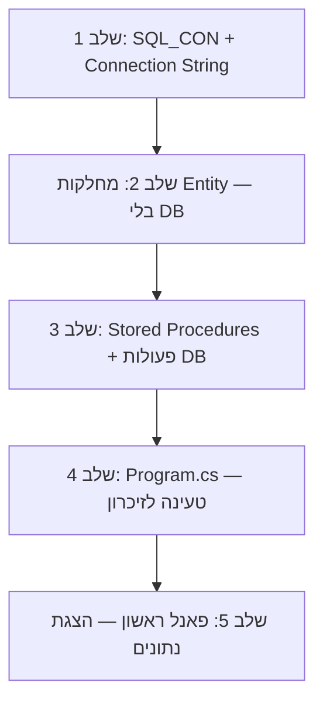

# סדר פיתוח — 5 הצעדים הראשונים

קיבלתם את פרויקט הדוגמה, יש לכם User Stories, Class Diagram ובסיס נתונים מוכן.
עכשיו צריך לבנות את המערכת שלכם. מאיפה מתחילים?

## סדר העבודה המומלץ



---

## שלב 1: הגדרת החיבור לבסיס הנתונים

**מה עושים:** מעדכנים את `SQL_CON.cs` עם ה-Connection String שלכם.

**למה קודם?** כי בלי חיבור תקין, שום דבר אחר לא יעבוד. עדיף לוודא את זה מוקדם.

**איך:**
1. פתחו את `SQL_CON.cs`
2. עדכנו את שם בסיס הנתונים (`Initial Catalog`):
```csharp
conn = new SqlConnection("Data Source=localhost\\SQLEXPRESS;Initial Catalog=YOUR_DB_NAME;Integrated Security=True;TrustServerCertificate=True");
```
3. הריצו את הפרויקט וודאו שאין שגיאת חיבור

**תוצאה:** חיבור תקין לבסיס הנתונים ✓

---

## שלב 2: בניית מחלקות ה-Entity

**מה עושים:** יוצרים מחלקת C# לכל ישות (Entity) ב-Class Diagram — **בלי** קוד של בסיס נתונים בשלב זה.

**למה?** כדי לוודא שהמבנה נכון לפני שמתחילים לחבר ל-DB. קל יותר לתקן טעויות במבנה עכשיו.

**איך — לכל ישות ב-Class Diagram:**

1. צרו קובץ חדש (Right Click על הפרויקט > Add > Class)
2. הגדירו את השדות לפי ה-Class Diagram:
```csharp
public class Customer
{
    private string customerId;
    private string customerName;
    private string phone;

    // בנאי
    public Customer(string id, string name, string phone, bool is_new)
    {
        this.customerId = id;
        this.customerName = name;
        this.phone = phone;
        // is_new - נטפל בזה בשלב 3
    }

    // Getters
    public string getId() { return this.customerId; }
    public string getName() { return this.customerName; }
    public string getPhone() { return this.phone; }

    // Setters (רק לשדות שניתן לעדכן)
    public void setName(string name) { this.customerName = name; }
    public void setPhone(string phone) { this.phone = phone; }
}
```

3. אם יש **Enum** — צרו אותו בקובץ נפרד עם Helper:
```csharp
public enum OrderStatus { ממתין_לאישור, בטיפול, הושלם, בוטל }
```

4. אם יש **ירושה** — צרו מחלקת אב ומחלקות בן:
```csharp
public class Product { ... }                  // אב
public class PhysicalProduct : Product { ... } // בן
public class DigitalProduct : Product { ... }  // בן
```

5. אם יש **קשרים (Associations)** — הוסיפו רשימות:
```csharp
// לקוח מכיל רשימת הזמנות (One-to-Many)
public List<Order> orders;
```

6. הוסיפו **מתודת חיפוש סטטית** — תצטרכו אותה בהמשך:
```csharp
public static Customer seekCustomer(string id)
{
    foreach (Customer c in Program.Customers)
    {
        if (c.getId() == id)
            return c;
    }
    return null;
}
```

**תוצאה:** כל מחלקות ה-Entity מוגדרות עם שדות, בנאי, getters, setters וחיפוש ✓

---

## שלב 3: חיבור המחלקות לבסיס הנתונים

**מה עושים:** כותבים Stored Procedures ומוסיפים פעולות DB בכל מחלקה.

**למה עכשיו?** כי המחלקות כבר מוכנות, אז אנחנו יודעים בדיוק אילו פרמטרים צריך.

**איך — לכל ישות:**

### א. כתבו Stored Procedures ב-SQL Server (דרך SSMS):

```sql
-- הוספה
CREATE PROCEDURE SP_add_customer @id VARCHAR(20), @name NVARCHAR(50), @phone VARCHAR(15)
AS INSERT INTO Customers VALUES (@id, @name, @phone);
GO

-- עדכון
CREATE PROCEDURE SP_update_customer @id VARCHAR(20), @name NVARCHAR(50), @phone VARCHAR(15)
AS UPDATE Customers SET customerName=@name, phone=@phone WHERE customerId=@id;
GO

-- מחיקה
CREATE PROCEDURE SP_delete_customer @id VARCHAR(20)
AS DELETE FROM Customers WHERE customerId=@id;
GO

-- שליפת הכל
CREATE PROCEDURE Get_all_customers
AS SELECT * FROM Customers;
GO
```

### ב. הוסיפו מתודות DB במחלקה:

```csharp
public void createCustomer()
{
    SqlCommand c = new SqlCommand();
    c.CommandText = "EXECUTE SP_add_customer @id, @name, @phone";
    c.Parameters.AddWithValue("@id", this.customerId);
    c.Parameters.AddWithValue("@name", this.customerName);
    c.Parameters.AddWithValue("@phone", this.phone);
    SQL_CON SC = new SQL_CON();
    SC.execute_non_query(c);
}
```

### ג. עדכנו את הבנאי עם `is_new`:
```csharp
public Customer(string id, string name, string phone, bool is_new)
{
    this.customerId = id;
    this.customerName = name;
    this.phone = phone;
    if (is_new)  // רק אם זה מופע חדש - שמור ב-DB
    {
        this.createCustomer();
    }
}
```

> **שימו לב ל-`is_new`:** כשטוענים נתונים מה-DB, לא רוצים לשמור אותם שוב!
> - `is_new = true` → נוצר ע"י המשתמש → שמור ב-DB
> - `is_new = false` → נטען מה-DB → לא שומרים שוב

**תוצאה:** כל מחלקה יודעת לשמור/לעדכן/למחוק את עצמה בבסיס הנתונים ✓

---

## שלב 4: טעינה לזיכרון (Program.cs)

**מה עושים:** ב-`Program.cs` יוצרים רשימות ומילאים אותן מבסיס הנתונים בעת הפעלת התוכנית.

**למה?** כדי לעבוד מהר — כל הנתונים בזיכרון, לא צריך לפנות ל-DB בכל פעולה.

**איך:**

### א. הגדירו רשימות סטטיות:
```csharp
public static List<Customer> Customers;
public static List<Order> Orders;
// רשימה לכל ישות...
```

### ב. כתבו מתודת טעינה סטטית **בתוך מחלקת ה-Entity** (לא ב-Program!):
```csharp
// בתוך Customer.cs — מתודה סטטית
public static void initCustomers()
{
    SqlCommand cmd = new SqlCommand();
    cmd.CommandText = "EXECUTE dbo.Get_all_customers";
    SQL_CON SC = new SQL_CON();
    SqlDataReader rdr = SC.execute_query(cmd);

    Program.Customers = new List<Customer>();
    while (rdr.Read())
    {
        Customer cust = new Customer(
            rdr.GetValue(0).ToString(),   // customerId
            rdr.GetValue(1).ToString(),   // customerName
            rdr.GetValue(2).ToString(),   // phone
            false                          // false = לא חדש, נטען מ-DB!
        );
        Program.Customers.Add(cust);
    }
}
```

> **למה בתוך Customer.cs ולא ב-Program.cs?**
> כי כל מה שקשור ל-Customer נמצא במקום אחד — שדות, CRUD, טעינה, חיפוש.
> ככה כשמוסיפים ישות חדשה, עובדים רק על קובץ אחד.

### ג. ב-Program.cs — הוסיפו רשימה וקריאה ב-initLists:
```csharp
// ב-Program.cs
public static List<Customer> Customers;  // הוסיפו רשימה

public static void initLists()
{
    Customer.initCustomers();   // תמיד קודם: ישויות שאחרים תלויים בהן
    Order.initOrders();         // אחר כך: ישויות שמכילות FK
}
```

> **סדר הטעינה חשוב!** טענו קודם ישויות "הורה" (כמו Customer)
> ורק אחר כך ישויות "ילד" (כמו Order שמפנה ל-Customer).

**תוצאה:** בהפעלת התוכנית, כל הנתונים נטענים לזיכרון ברשימות ✓

---

## שלב 5: בניית הטופס הראשון

**מה עושים:** יוצרים טופס WinForms שמציג נתונים מהרשימות בזיכרון.

**למה להתחיל מתצוגה?** כי זו הדרך הכי מהירה לוודא שהכל עובד — אם אתם רואים נתונים על המסך, סימן שהחיבור, הטעינה והמחלקות עובדים נכון.

**איך:**

1. צרו טופס חדש (Right Click > Add > Windows Form)
2. גררו **DataGridView** מה-Toolbox לטופס
3. ב-Load של הטופס, מלאו את הטבלה מהרשימה בזיכרון:

```csharp
private void MyForm_Load(object sender, EventArgs e)
{
    DataTable dt = new DataTable();
    dt.Columns.Add("מזהה", typeof(string));
    dt.Columns.Add("שם", typeof(string));
    dt.Columns.Add("טלפון", typeof(string));

    foreach (Customer c in Program.Customers)
    {
        dt.Rows.Add(c.getId(), c.getName(), c.getPhone());
    }

    dataGridView1.DataSource = dt;
}
```

4. הריצו — אם רואים נתונים, הכל עובד!

**תוצאה:** טופס שמציג נתונים מבסיס הנתונים על המסך ✓

---

## מה אחרי 5 הצעדים?

לאחר שהצעדים האלה עובדים, אפשר להמשיך ל:
- טפסי יצירה (Create) — הוספת רשומות חדשות
- טפסי עדכון ומחיקה (Update/Delete)
- טופס כניסה (Login)
- טפסים נוספים לפי ה-User Stories שלכם

**הכלל:** תמיד בנו מלמטה למעלה (DB → מחלקות → זיכרון → UI).
אל תתחילו מהטפסים — בלי שכבת הנתונים הם ריקים ולא מועילים.

---

## צ'קליסט: הוספת ישות חדשה למערכת

כשמוסיפים ישות חדשה (למשל `Customer`), אלו **כל הקבצים שצריך לגעת בהם** ובאיזה סדר:

### קובץ 1: SQL Server (דרך SSMS)
- [ ] יצירת טבלה ב-DB
- [ ] יצירת Stored Procedures: הוספה, עדכון, מחיקה, שליפה
- [ ] הוספת נתוני דוגמה לבדיקה
- [ ] עדכון `create_database.sql` עם הטבלה וה-SPs

### קובץ 2: `Customer.cs` (הקובץ העיקרי — הכל כאן!)
- [ ] שדות (fields)
- [ ] בנאי עם `is_new`
- [ ] Getters & Setters
- [ ] רשימות קשרים (אם יש One-to-Many)
- [ ] פעולות DB: `createCustomer()`, `updateCustomer()`, `deleteCustomer()`
- [ ] מתודה סטטית: `initCustomers()` — טעינה מה-DB
- [ ] מתודה סטטית: `seekCustomer(id)` — חיפוש ברשימה

### קובץ 3: `Program.cs` (רק 2 שורות!)
- [ ] הוספת רשימה: `public static List<Customer> Customers;`
- [ ] הוספת קריאה ב-`initLists()`: `Customer.initCustomers();`

### קובץ 4: טפסים (לפי הצורך)
- [ ] טופס תצוגה — DataGridView שמציג מהרשימה
- [ ] טופס יצירה — שדות קלט + קריאה לבנאי עם `is_new = true`
- [ ] טופס עדכון/מחיקה — חיפוש + עדכון/מחיקה

### מבנה הקובץ של ישות (תבנית):

```csharp
// Customer.cs
using System;
using System.Collections.Generic;
using Microsoft.Data.SqlClient;

namespace Example_Project
{
    public class Customer
    {
        // === שדות ===
        private string customerId;
        private string customerName;
        private string phone;

        // === בנאי ===
        public Customer(string id, string name, string phone, bool is_new)
        {
            this.customerId = id;
            this.customerName = name;
            this.phone = phone;
            if (is_new)
            {
                this.createCustomer();
                Program.Customers.Add(this);
            }
        }

        // === Getters & Setters ===
        public string getId() { return this.customerId; }
        public string getName() { return this.customerName; }
        public string getPhone() { return this.phone; }
        public void setName(string name) { this.customerName = name; }
        public void setPhone(string phone) { this.phone = phone; }

        // === פעולות DB ===
        public void createCustomer()
        {
            SqlCommand cmd = new SqlCommand();
            cmd.CommandText = "EXECUTE SP_add_customer @id, @name, @phone";
            cmd.Parameters.AddWithValue("@id", this.customerId);
            cmd.Parameters.AddWithValue("@name", this.customerName);
            cmd.Parameters.AddWithValue("@phone", this.phone);
            SQL_CON SC = new SQL_CON();
            SC.execute_non_query(cmd);
        }

        // updateCustomer(), deleteCustomer() — אותו דפוס...

        // === מתודות סטטיות — טעינה וחיפוש ===
        public static void initCustomers()
        {
            SqlCommand cmd = new SqlCommand();
            cmd.CommandText = "EXECUTE dbo.Get_all_customers";
            SQL_CON SC = new SQL_CON();
            SqlDataReader rdr = SC.execute_query(cmd);

            Program.Customers = new List<Customer>();
            while (rdr.Read())
            {
                Customer c = new Customer(
                    rdr.GetValue(0).ToString(),
                    rdr.GetValue(1).ToString(),
                    rdr.GetValue(2).ToString(),
                    false);
                Program.Customers.Add(c);
            }
        }

        public static Customer seekCustomer(string id)
        {
            foreach (Customer c in Program.Customers)
            {
                if (c.getId() == id)
                    return c;
            }
            return null;
        }
    }
}
```

---

## טיפ חשוב: תמיד בדקו null אחרי חיפוש!

כשמחפשים ישות ברשימה (למשל `seekWorker`, `seekCustomer`), התוצאה יכולה להיות `null` אם הישות לא נמצאה. אם תנסו לגשת לשדות של `null` — **התוכנית תקרוס**.

### הדרך הלא נכונה:
```csharp
Worker w = Worker.seekWorker(textBox_id.Text);
textBox_name.Text = w.getName();  // 💥 קריסה אם w == null!
```

### הדרך הנכונה — בדיקת null ראשונה:
```csharp
Worker w = Worker.seekWorker(textBox_id.Text);
if (w == null)
{
    MessageBox.Show("עובד לא נמצא", "שגיאה", MessageBoxButtons.OK);
    return;  // יציאה מהמתודה — לא ממשיכים!
}
// מכאן בטוח ש-w קיים
textBox_name.Text = w.getName();
```

### הדפוס (Pattern):
```csharp
// 1. חיפוש
var result = Entity.seekEntity(id);

// 2. בדיקת null
if (result == null)
{
    MessageBox.Show("לא נמצא", "שגיאה", MessageBoxButtons.OK);
    return;
}

// 3. שימוש בטוח
result.doSomething();
```

> **כלל אצבע:** בכל מקום שאתם קוראים ל-seek — הוסיפו בדיקת null מיד אחריו.
> אל תניחו שהחיפוש תמיד יצליח — המשתמש יכול להזין מזהה שלא קיים.
