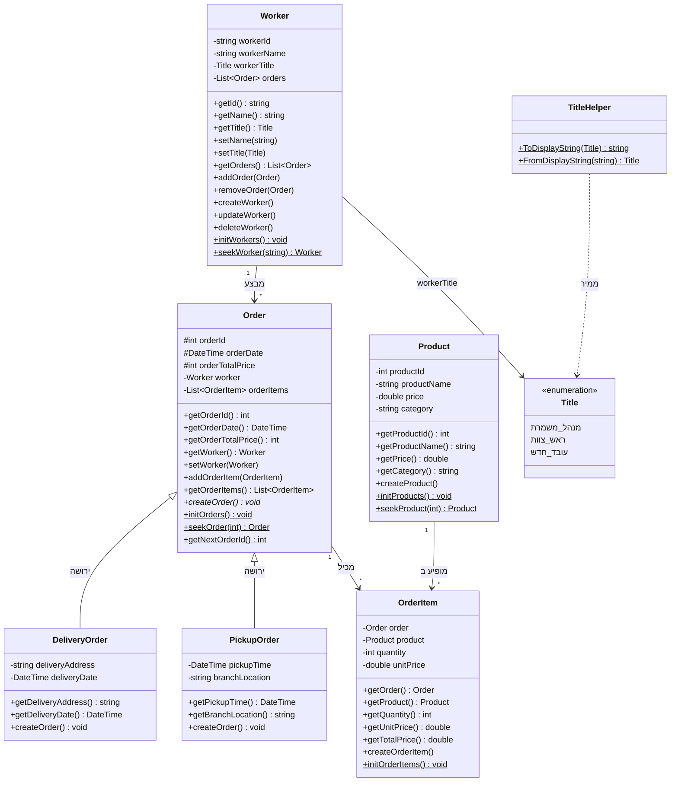
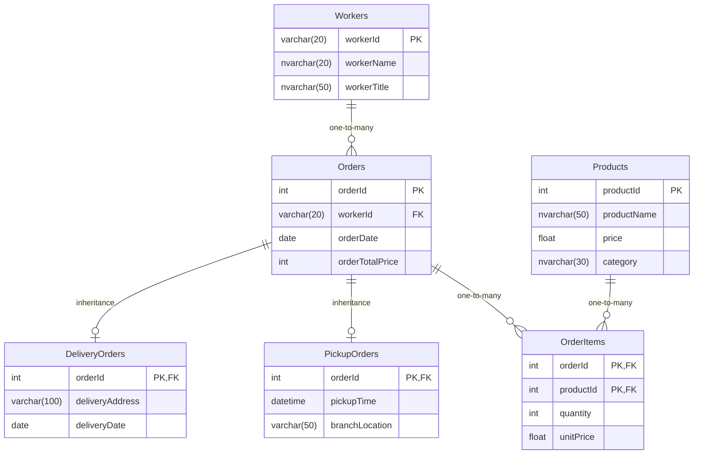
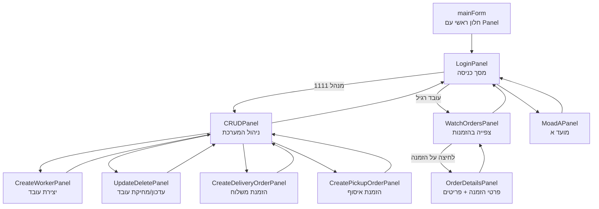

# דיאגרמות הפרויקט

## 1. Class Diagram

```mermaid
classDiagram
    class Worker {
        -string workerId
        -string workerName
        -Title workerTitle
        -List~Order~ orders
        +getId() string
        +getName() string
        +getTitle() Title
        +setName(string)
        +setTitle(Title)
        +getOrders() List~Order~
        +addOrder(Order)
        +removeOrder(Order)
        +createWorker()
        +updateWorker()
        +deleteWorker()
        +initWorkers()$ void
        +seekWorker(string)$ Worker
    }

    class Order {
        #int orderId
        #DateTime orderDate
        #int orderTotalPrice
        -Worker worker
        -List~OrderItem~ orderItems
        +getOrderId() int
        +getOrderDate() DateTime
        +getOrderTotalPrice() int
        +getWorker() Worker
        +setWorker(Worker)
        +addOrderItem(OrderItem)
        +getOrderItems() List~OrderItem~
        +createOrder()* void
        +initOrders()$ void
        +seekOrder(int)$ Order
        +getNextOrderId()$ int
    }

    class DeliveryOrder {
        -string deliveryAddress
        -DateTime deliveryDate
        +getDeliveryAddress() string
        +getDeliveryDate() DateTime
        +createOrder() void
    }

    class PickupOrder {
        -DateTime pickupTime
        -string branchLocation
        +getPickupTime() DateTime
        +getBranchLocation() string
        +createOrder() void
    }

    class Product {
        -int productId
        -string productName
        -double price
        -string category
        +getProductId() int
        +getProductName() string
        +getPrice() double
        +getCategory() string
        +createProduct()
        +initProducts()$ void
        +seekProduct(int)$ Product
    }

    class OrderItem {
        -Order order
        -Product product
        -int quantity
        -double unitPrice
        +getOrder() Order
        +getProduct() Product
        +getQuantity() int
        +getUnitPrice() double
        +getTotalPrice() double
        +createOrderItem()
        +initOrderItems()$ void
    }

    class Title {
        <<enumeration>>
        מנהל_משמרת
        ראש_צוות
        עובד_חדש
    }

    class TitleHelper {
        +ToDisplayString(Title)$ string
        +FromDisplayString(string)$ Title
    }

    Worker "1" --> "*" Order : מבצע
    Order <|-- DeliveryOrder : ירושה
    Order <|-- PickupOrder : ירושה
    Order "1" --> "*" OrderItem : מכיל
    Product "1" --> "*" OrderItem : מופיע ב
    Worker --> Title : workerTitle
    TitleHelper ..> Title : ממיר
```

## 2. Entity Relationship Diagram (ERD)

```mermaid
erDiagram
    Workers {
        varchar(20) workerId PK
        nvarchar(20) workerName
        nvarchar(50) workerTitle
    }

    Orders {
        int orderId PK
        varchar(20) workerId FK
        date orderDate
        int orderTotalPrice
    }

    DeliveryOrders {
        int orderId PK,FK
        varchar(100) deliveryAddress
        date deliveryDate
    }

    PickupOrders {
        int orderId PK,FK
        datetime pickupTime
        varchar(50) branchLocation
    }

    Products {
        int productId PK
        nvarchar(50) productName
        float price
        nvarchar(30) category
    }

    OrderItems {
        int orderId PK,FK
        int productId PK,FK
        int quantity
        float unitPrice
    }

    Workers ||--o{ Orders : "one-to-many"
    Orders ||--o| DeliveryOrders : "inheritance"
    Orders ||--o| PickupOrders : "inheritance"
    Orders ||--o{ OrderItems : "one-to-many"
    Products ||--o{ OrderItems : "one-to-many"
```

## 3. מבנה הניווט (Panels)

```mermaid
flowchart TD
    A[mainForm<br/>חלון ראשי עם Panel] --> B[LoginPanel<br/>מסך כניסה]
    B -->|מנהל 1111| C[CRUDPanel<br/>ניהול המערכת]
    B -->|עובד רגיל| D[WatchOrdersPanel<br/>צפייה בהזמנות]
    B --> E[MoadAPanel<br/>מועד א]
    C --> F[CreateWorkerPanel<br/>יצירת עובד]
    C --> G[UpdateDeletePanel<br/>עדכון/מחיקת עובד]
    C --> H[CreateDeliveryOrderPanel<br/>הזמנת משלוח]
    C --> I[CreatePickupOrderPanel<br/>הזמנת איסוף]
    D -->|לחיצה על הזמנה| J[OrderDetailsPanel<br/>פרטי הזמנה + פריטים]
    F --> C
    G --> C
    H --> C
    I --> C
    J --> D
    E --> B
    C --> B
    D --> B
```
